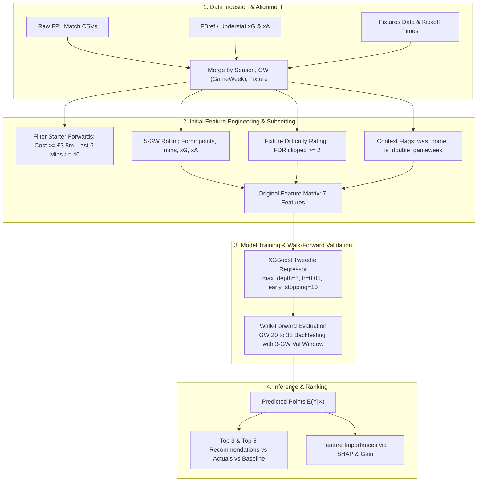

# FPL Prediction Model — Project Log

A log of empirical findings, architectural trade-offs, and modeling decisions across development and backtesting.

---

## Pipeline Architecture



---

## Original Model Specification & Baseline Setup

The initial predictive pipeline was developed to forecast weekly expected points for starting forwards using historical multi-season match data (2022–23 through 2025–26).

### 1. Population Filtering & Target Definition
* **Position Filter**: Forwards (`is_FWD == 1`) with minimum price threshold (`new_cost >= 38` / £3.8m).
* **Starter Qualification**: Players with `rolling_avg_mins_last_5 >= 40` to avoid minutes-based noise on non-starting forwards.
* **Target Variable**: `target_points = total_points.clip(lower=0)` (enforcing non-negativity required for Tweedie loss).

This eliminates all bench and non-regular starters who will dilute the model.

### 2. Original Feature Set (7 Baseline Features)
The original feature matrix focused purely on short-term 5-gameweek rolling performance, official fixture difficulty ratings, and contextual match flags:

| Feature Name | Horizon / Type | Description |
| :--- | :--- | :--- |
| `rolling_avg_points_last_5` | 5-Match Rolling | 5-match rolling average of FPL total points (shifted $t-1$). |
| `rolling_avg_mins_last_5`   | 5-Match Rolling | 5-match rolling average of minutes played (shifted $t-1$). |
| `rolling_avg_xG_last_5`     | 5-Match Rolling | 5-match rolling average of expected goals ($xG$). |
| `rolling_avg_xA_last_5`     | 5-Match Rolling | 5-match rolling average of expected assists ($xA$). |
| `fixture_difficulty`        | Categorical/Ordinal (2–5) | Official FPL Fixture Difficulty Rating (FDR from `fixtures.csv`, mapped via `team_h_difficulty`/`team_a_difficulty` based on venue, clipped lower bound at 2). |
| `was_home`                  | Binary Flag | Home venue indicator ($1 = \text{Home}, 0 = \text{Away}$). |
| `is_double_gameweek`        | Binary Flag | Multi-match gameweek indicator ($1 = \text{Double GW}, 0 = \text{Single GW}$). |

### 3. Original XGBoost Model & Hyperparameters
XGBoost was chosen for its ability to naturally capture non-linear player-fixture interactions on tabular data and its native support for Tweedie loss without requiring feature scaling.

* `objective`: `'reg:tweedie'`
* `tweedie_variance_power`: `1.2`
* `learning_rate`: `0.05`
* `n_estimators`: `100`
* `max_depth`: `5`
* `early_stopping_rounds`: `10`
* `random_state`: `42`
* **Validation Scheme**: Sliding 3-gameweek window (`gw - 3` to `gw - 1`) used for early stopping within a walk-forward loop (GW 20 to 38).

---

### 4. Why Tweedie Regression (`reg:tweedie`)?

Fantasy Premier League points exhibit distinct distributional properties that violate standard regression assumptions:

```
      Predicted Points Distribution                        Actual Points Distribution
             (GW 34 to 38)                                       (GW 34 to 38)
    30 |            ┌─┐                                50 |  ┌─┐ ┌─┐
       |            │ │                                   |  │ │ │ │
    20 |        ┌─┐ │ │ ┌─┐                            30 |  │ │ │ │
       |    ┌─┐ │ │ │ │ │ │ ┌─┐                           |  │ │ │ │
    10 |  ┌─┤ │ │ │ │ │ │ │ │ │ ┌─┐                    10 |  │ │ │ │   ┌─┐ ┌─┐ ┌─┐ ┌─┐
       |  │ │ │ │ │ │ │ │ │ │ │ │ │                       |  │ │ │ │   │ │ │ │ │ │ │ │ ┌─┐ ┌─┐
     0 └──┴─┴─┴─┴─┴─┴─┴─┴─┴─┴─┴─┴─┴─>                   0 └──┴─┴─┴─┴─┴─┴─┴─┴─┴─┴─┴─┴─┴─┴─┴─┴─>
       1    2    3    4    5    6                            0   2   4   6   8  10  12  14  16
              Predicted Points                                      Actual Target Points
```

#### Key Distributional Characteristics
1. **Zero-Inflation & Mass at 1–2 Points (Right Plot)**:
   * The actual distribution is heavily concentrated at the lower bound: over 50% of starter appearances result in 1 to 2 points (points given just for playing minutes).
   * Beyond 2 points, there is an immediate drop followed by an extended, highly positive-skewed right tail stretching up to 16+ points for multi-goal hauls.
2. **Standard Loss Functions vs. Poisson Nature of FPL Points**:
   * Standard loss functions (such as squared error / OLS) assume a symmetric normal distribution (bell curve). However, FPL points follow a Poisson-like count process where low scores are common and explosive hauls are rare, non-negative events.
   * The **Tweedie distribution** with power parameter $1 < p < 2$ (here, $p = 1.2$) bridges Poisson and Gamma distributions, enforcing non-negative support and explicitly modeling the mean-variance relationship:
     $$\text{Var}(Y) = \phi \cdot \mu^p \quad (p = 1.2)$$
3. **Conditional Expectation Calibration (Left Plot)**:
   * As shown in the left distribution, `reg:tweedie` maps these skewed outcomes into smooth conditional expected values $E[Y|X]$ centered between $1.5$ and $5.5\text{ points}$, preventing extreme outlier distortion while preserving accurate rank order across players.

---

## Key Investigations & Empirical Findings

### 1. Collinearity & Feature Dilution: Composite Opponent Difficulty
* **Problem**: Passing multiple collinear opponent metrics (`opp_league_pos`, `team_xg`, `opp_xg_allowed`) caused tree splits to fragment, reducing the feature importance of `rolling_avg_points_last_5` from ~16% to 13.5% and lowering Spearman rank correlation from 0.25 to 0.19.
* **Root Cause**: Gradient boosted decision trees split arbitrarily across correlated features in shallow trees, diluting the primary signal from recent player form.
* **Fix**: Consolidated individual opponent metrics into a normalized **Composite Opponent Difficulty Index**:
  $$\text{Composite Difficulty} = \left(\frac{\text{Opponent League Position}}{20.0}\right) \times 0.5 + \left(\frac{\text{Opponent Season xGA}}{2.5}\right) \times 0.5$$
* **Result**: Restored `rolling_avg_points_last_5` to **19.95%** relative importance (#1 feature) and improved weekly correlation to **0.2530**.

---

### 2. Multi-Horizon Form vs. Baseline Class (5, 15, and 38 Gameweeks)
* **Problem**: Relying solely on a short 5-gameweek rolling window left the model susceptible to short-term variance. When premium assets (e.g., Haaland, Watkins) experienced two consecutive low-scoring matches, their rolling metrics dropped sharply, causing the model to prematurely favor budget players facing weaker opposition.
* **Fix**: Evaluated longer 15-gameweek and 38-gameweek rolling windows to capture player class and establish a more robust performance baseline.
* **Empirical Comparison (2024–25 & 2025–26 Seasons)**:

| Configuration | 2024–25 Weekly Corr | 2024–25 Top 5 Pts | 2025–26 Weekly Corr | 2025–26 Top 5 Pts | Haaland Selections (2025–26) |
| :--- | :---: | :---: | :---: | :---: | :---: |
| **5-GW Form Only** | `0.1622` | `4.45 pts` | `0.2530` | `4.33 pts` | 23 / 38 |
| **5-GW + 15-GW Baseline** | `0.1598` | `4.36 pts` | `0.2204` | `4.19 pts` | 20 / 38 |
| **5-GW + 38-GW Baseline** | **`0.1925`** | **`4.44 pts`** | **`0.2370`** | **`4.41 pts`** | **28 / 38** |

* **Takeaway**: A 15-game window serves as an suboptimal middle ground by lagging short-term form while being too short to establish long-term class. A 38-game rolling horizon spans a full season, establishing a reliable talent floor for premium assets across temporary dips in form.

---

### 3. BPS Representation: Continuous Raw BPS vs. Ordinal Match Rank
* **Question**: Should Bonus Point System (BPS) metrics be transformed into an ordinal match rank (#1 player in match) or preserved as continuous values?

| BPS Feature Tested | Weekly Spearman | Pooled Spearman | NDCG | Top 20% Weekly Spearman | Top 5 Avg Points |
| :--- | :---: | :---: | :---: | :---: | :---: |
| **No BPS** | `0.2472` | `0.2533` | `0.7384` | `0.1843` | `4.31 pts` |
| **Ordinal Match Rank (5-GW Rank)** | `0.2455` | `0.2535` | `0.7319` | `0.0477` | `4.33 pts` |
| **Ordinal Match Rank (38-GW Rank)** | `0.2343` | `0.2421` | `0.7359` | `0.1633` | `4.31 pts` |
| **Raw Continuous BPS (38-GW Avg)** | **`0.2588`** | **`0.2630`** | **`0.7410`** | **`0.1230`** | **`4.46 pts`** |

* **Takeaway**: Discretizing BPS into ordinal ranks compresses information magnitude; a dominant 64-BPS performance is reduced to the same rank as a 21-BPS output in a scoreless draw. Continuous BPS retains underlying performance scale and player involvement.

---

### 4. Expected Value Ceilings vs. Single-Match Variance
* **Observation**: Point predictions typically span a compressed range between $2.0$ and $5.5$, whereas realized weekly scores exhibit high positive skewness reaching $13 - 17\text{ points}$.
* **Mathematical Reality**: Regression objectives estimate conditional expectation $E[Y|X]$. Even elite assets carry non-trivial probabilities of blanks (~30% for 2 pts), single-return outcomes (~35% for 5–6 pts), and low probabilities of multi-goal hauls (~15% for $13+\text{ pts}$). Probability-weighted expected points naturally compress to $\approx 4.5 - 5.5\text{ pts}$.
* **Central Limit Theorem Validation**: Over multi-week evaluation windows (GW 1 to 10), noisy weekly Poisson realizations converge toward expected averages ($\mu_{\text{actual}} = 3.10$ vs. $\mu_{\text{predicted}} = 3.35$):

#### 5-Number Summary: 10-Game Per-Player Average (GW 1 to 10)
| Statistic | 10-Game Avg Predicted Points ($E[Y]$) | 10-Game Avg Actual Points Scored ($\bar{Y}$) |
| :--- | :---: | :---: |
| **Minimum (`min`)** | `2.11` | `0.00` |
| **25th Percentile (`Q1`)** | `2.82` | `2.00` |
| **Median (`50%`)** | `3.32` | `2.76` |
| **75th Percentile (`Q3`)** | `3.97` | `4.31` |
| **Maximum (`max`)** | `4.72` | `9.80` *(Haaland anomaly)* |
| *Mean* | *`3.35`* | *`3.10`* |
| *Std Dev* | *`0.71`* | *`1.97` (variance smoothed over 10 GWs)* |

---

### 5. Quartile Stratification & Elite Asset Discrimination (Top 20% vs. Bottom 80%)
* **Problem**: Although the model achieved a strong overall Spearman rank correlation across the broader player pool, its top-ranked selections did not consistently outperform baseline averages. While the model effectively stratified tiers across the full dataset, it struggled to reliably isolate elite, high-ceiling talent within the top tier.
* **Evaluation**: Assessed the model's ability to discriminate between distinct performance tiers:

#### 4-Quartile Stratification (2025–26 Season)
| Quartile Tier | Avg Players / GW | Avg Actual Pts Scored | Avg Predicted Pts | Intra-Bucket Spearman |
| :--- | :---: | :---: | :---: | :---: |
| **Q4 (Top 75–100%)** | `6.1` | **`4.26 pts`** | `4.35 pts` | `0.0275` |
| **Q3 (Upper 50–75%)** | `5.4` | **`3.39 pts`** | `3.38 pts` | `0.1540` |
| **Q2 (Lower 25–50%)** | `5.7` | **`3.10 pts`** | `2.91 pts` | `0.0905` |
| **Q1 (Bottom 0–25%)** | `6.2` | **`2.29 pts`** | `2.32 pts` | `-0.0126` |

#### Top 20% vs Bottom 80% Split
| Bucket | Avg Players / GW | Avg Actual Pts Scored | Avg Predicted Pts | Pooled Spearman |
| :--- | :---: | :---: | :---: | :---: |
| **Top 20% (Elite Picks)** | **`5.1`** | **`4.30 pts`** | `4.47 pts` | `0.0915` |
| **Bottom 80% (Rest of Pool)** | **`18.3`** | **`2.96 pts`** | `2.90 pts` | `0.1909` |
| **Full Player Pool (Overall)** | **`23.3`** | **`3.25 pts`** | `3.24 pts` | **`0.2552`** |

* **Takeaway**: The model exhibits strong **monotonic calibration** across global tiers ($\text{Q1: 2.29} \to \text{Q2: 3.10} \to \text{Q3: 3.39} \to \text{Q4: 4.26}$). However, intra-bucket correlation within the Top 20% remains low because top options are clustered within a narrow predicted range ($4.3 - 4.8\text{ pts}$), where single-match stochasticity dominates the ordering.

---

## Main Takeaways & Future Directions

* **Limitations of Direct Single-Stage Point Regression**: 
  Directly predicting FPL points in a single regression step forces the model toward conditional mean values ($E[Y|X]$). As highlighted by the elite discrimination challenge (Investigation 5), this collapses variance and obscures the distinct mechanisms driving point returns: playing time volume versus per-minute efficiency.

* **Multi-Stage Modeling Architecture**: 
  Instead of predicting raw fantasy points outright, a decoupled multi-model pipeline provides a more theoretically sound structure:
  1. **Expected Minutes Model ($M_1$)**: A dedicated classifier/regressor predicting starting probability and expected minutes on the pitch, isolating rotation risk and substitution patterns.
  2. **Per-90 Productivity Model ($M_2$)**: A conditional rate model predicting underlying per-90 metrics ($xG_{90}$, $xA_{90}$, $\text{BPS}_{90}$) weighted by opponent difficulty and historical form.
  3. **Composite Scoring & Distributional Output**: Multiplying expected minutes by per-minute expected points (or simulating Poisson/negative binomial outcome distributions) to better capture upside tails, improve intra-tier separation among elite picks, and optimize captaincy selection.

---

## Evaluation Metrics Analysis & Future Validation

### Limitations of Global Spearman Correlation
Throughout backtesting, **Spearman Rank Correlation** served as the primary optimization metric due to its robustness against non-linear scaling and raw point outliers. However, reliance on global Spearman correlation has a notable flaw in fantasy sports:
* **Uniform Penalty Distribution**: Spearman treats rank errors symmetrically across the entire distribution. Misordering the 180th and 181st ranked bench player carries the exact same penalty as misordering the #1 and #5 captaincy candidates.
* **Masking Elite-Tier Compression**: A high overall correlation ($\rho \approx 0.25 - 0.26$) can occur simply because the model easily differentiates between guaranteed starters and fringe players, even when it has near-zero predictive power among the top 10 actionable assets.

### Metrics Evaluated & Future Benchmarking Suite
To address these blind spots, upcoming work will incorporate a broader suite of decision-centric evaluation metrics:

1. **Top-Heavy Ranking Metrics (NDCG@K)**:
   * **NDCG@3 and NDCG@5**: Measures ranking accuracy with a logarithmic discount for lower positions, prioritizing high accuracy at the very top of the leaderboard where transfers and captaincy decisions occur.
2. **Top-K Realized Yield (Top 5 Points)**:
   * Tracks the actual average points achieved by the top 5 predicted players against the template/most selected average to measure practical in-game advantage.
3. **Intra-Bucket / Segmented Rank Correlation**:
   * Evaluates Spearman correlation specifically within the Top 20% player pool to determine whether the model can resolve fine-grained differences among premium assets.
4. **Calibration & Distributional Loss**:
   * Assessing negative log-likelihood (NLL) and Poisson deviance to validate whether the model accurately models return probabilities rather than just point averages.
5. **Simulated FPL Manager ROI / Backtesting**:
   * Simulating a full squad-selection strategy across a 38-gameweek season to evaluate total points accrued against benchmark heuristics (e.g., always captaining highest-ownership player).